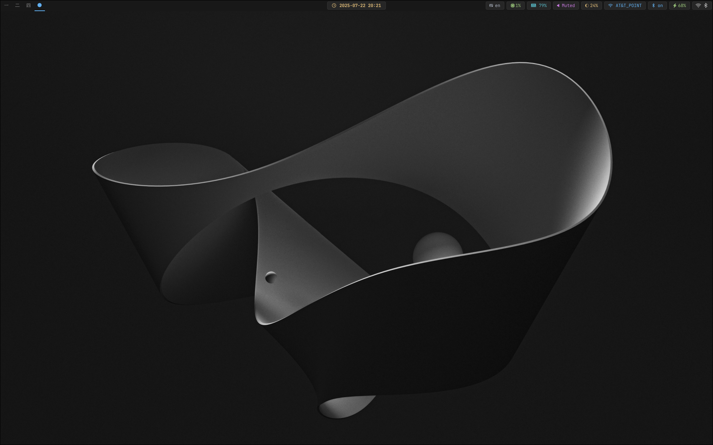

# desktop-nixos
My main desktop nixos configuration / Моя главная конфигурация NixOS с переводом на русский.



## Installing

```bash
git clone https://github.com/alexeev-prog/desktop-nixos $HOME/nixos
cd $HOME/nixos
sudo nixos-rebuild switch --flake .
home-manager switch --flake .
```
